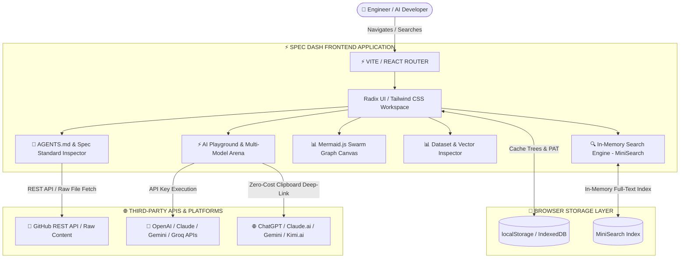
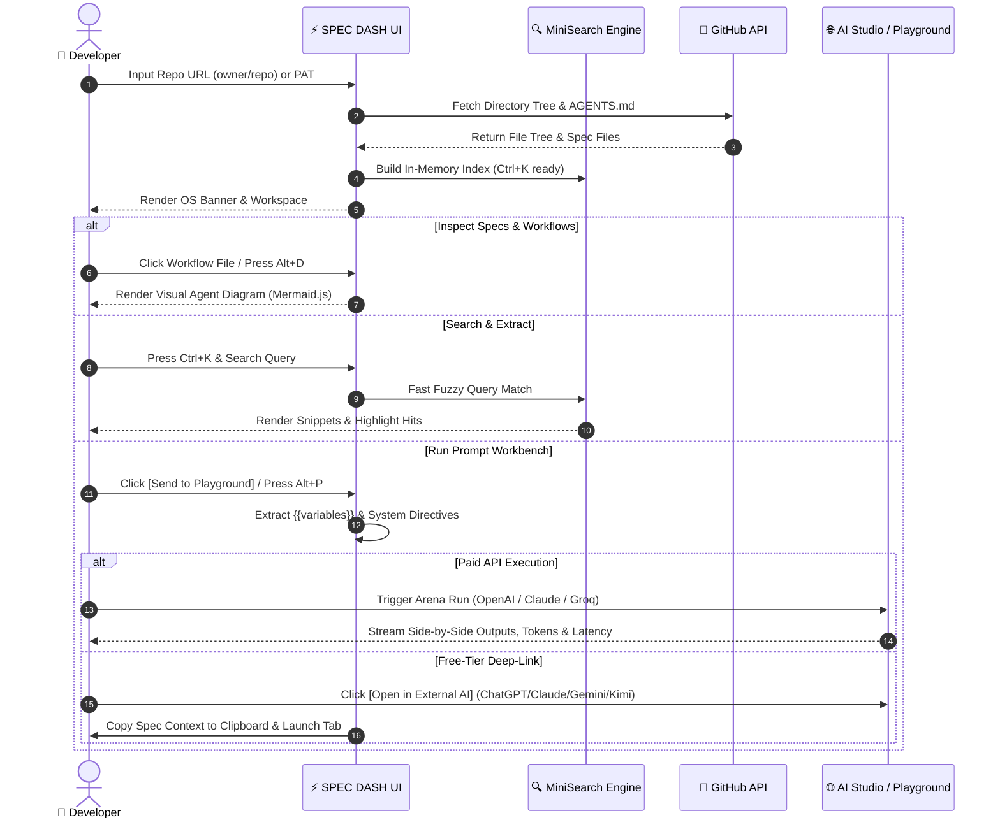

<div align="center">
<pre>
███████╗██████╗ ███████╗ ██████╗   ██████╗  █████╗ ███████╗██╗  ██╗
██╔════╝██╔══██╗██╔════╝██╔════╝   ██╔══██╗██╔══██╗██╔════╝██║  ██║
███████╗██████╔╝█████╗  ██║        ██║  ██║███████║███████╗███████║
╚════██║██╔═══╝ ██╔══╝  ██║        ██║  ██║██╔══██║╚════██║██╔══██║
███████║██║     ███████╗╚██████╗   ██████╔╝██║  ██║███████║██║  ██║
╚══════╝╚═╝     ╚══════╝ ╚═════╝   ╚═════╝ ╚═╝  ╚═╝╚══════╝╚═╝  ╚═╝
 [ R&D_EXPERIMENTATION_SYSTEM // GITHUB_AS_A_DATABASE ]
</pre>
</div>

---
<div align="center">

# ⚡ SPEC-DASH | Dynamic AI Repo Dashboard

**An ultra-fast, zero-cost, brutalist control center for AI-native GitHub repositories.**  
*Transform markdown specs, `AGENTS.md` operating manuals, and prompt libraries into interactive, LLM-powered workspaces.*

---
[](https://specdash.lovable.app)
[](LICENSE)
[-000000.svg?style=for-the-badge&logo=fastapi&logoColor=white)](#-rate-limit--performance-architecture)
[](#)
[](#-rate-limit--performance-architecture)
[](#-system-architecture--data-flow)
[](#-multi-llm-architecture)
[](#-responsive-viewport-support)


[](https://www.linkedin.com/in/rahuldesai101)

</div>

---

**[ 📜 Readme Center ](#-end-to-end-user-flow)** 

<br/>

```text
  ┌────────────────────────────────────────────────────────────────────────┐
  │  [ SPEC_DASH // GITHUB_AS_A_DATABASE ]                                 │
  │  Ultra-fast control center for AI-native specs, agents & prompts      │
  └────────────────────────────────────────────────────────────────────────┘

```

---

## 📄 Overview

**SPEC DASH** transforms standard GitHub repositories into high-performance, interactive database layers designed specifically for AI-native software development. It bridges the gap between human engineers, markdown documentation, and AI coding agents (Copilot, Cursor, Claude Code, AutoGen, CrewAI).

By serving as a zero-cost, zero-backend workspace, SPEC DASH parses open standards like `AGENTS.md` and `llms.txt`, visualizes multi-agent swarm workflows, inspects evaluation datasets, and provides an integrated AI Playground featuring side-by-side model comparison and free-tier deep-linking.

---

## 🏗️ System Architecture & Data Flow

SPEC DASH operates entirely in the browser as an ultra-fast client-side application. It leverages local caching mechanisms and directly communicates with external GitHub & LLM APIs without requiring intermediate server infrastructure.



---

## 🔄 End-to-End User Flow



### User Journey Breakdown:

1. **Repository Onboarding:** User enters a public repository URL or personal access token (PAT). The app scans root standards (`AGENTS.md`, `llms.txt`, `.cursorrules`).
2. **Context Discovery:** Press `Ctrl+K` to search across raw markdown code, headers, and frontmatter tags using in-memory full-text search.
3. **Multi-Agent Diagramming:** Open YAML workflows or Mermaid diagrams to visualize agent swarms with a smooth pan/zoom canvas (`Alt+D`).
4. **Prompt Engineering & Execution:** Press `Alt+P` to send any specification straight into the AI Playground. Test prompt variables (`{{var}}`), run side-by-side Arena benchmarking, or use the 1-click **External AI Deep-Link Studio** to test directly in ChatGPT, Claude, Gemini, or Kimi AI without paying for API keys.

---

## ⚡ Key Features

```
               ┌─────────────────────────────────────────┐
               │         ⚡ SPEC DASH WORKSPACE          │
               └────────────────────┬────────────────────┘
                                    │
    ┌─────────────────┬─────────────┼─────────────┬─────────────────┐
    ▼                 ▼             ▼             ▼                 ▼
 🤖 AGENTS.md     ⚡ AI          🌐 Free AI      📊 Visual       🔍 Instant
  & Spec Parser   Playground      Deep-Link       Workflows       Full Search
 (Open Specs)     (Arena Mode)   (ChatGPT/etc)   (Mermaid.js)     (Ctrl + K)

```

### 🤖 1. Native AGENTS.md & Open AI Standards Parser

* **Automatic Root Detection:** Scans repository roots for `AGENTS.md`, `llms.txt`, `agents.txt`, and `.cursorrules`.
* **AI Operating System Header:** Renders agent boundaries, execution rules, style guides, and 1-click executable build commands (`npm test`, `pytest`, `cargo check`).
* **Sticky Spec Drawer:** Instant side-panel access to agent directives while browsing complex code structures.

### ⚡ 2. AI Playground & Multi-Model Arena Workbench

* **Mustache Variable Extraction (`{{var}}`):** Automatically detects parameters in prompt templates and renders dynamic form fields for rapid variable testing.
* **Arena Comparison View:** Run prompts simultaneously across multiple models to compare latency ($ms$), output token count, and estimated cost side-by-side.
* **Hyper-Parameter Controls:** Fine-tune Temperature, Top-P, Max Tokens, and System Directives in real-time.

### 🌐 3. Free-Tier External AI Deep-Link Studio

* **Zero-Cost Prompting:** Designed for users without paid API keys.
* **1-Click External Execution:** Formats system guidelines, current file context, and user prompts, copies them to the clipboard, and launches directly in **ChatGPT**, **Claude**, **Google Gemini**, or **Kimi AI**.

### 📊 4. Visual Workflows & Agent Swarm Graph Engine

* **Diagram Auto-Rendering:** Converts `Mermaid.js` syntax, GitHub workflows, and multi-agent topologies into interactive SVGs.
* **Pan & Zoom Canvas:** Zero-flicker transformation canvas with zoom controls, reset triggers, and non-destructive full-screen toggle (`Alt + D`).

### 📊 5. Embedded Datasets & Vector Inspector

* **Structured Data Viewer:** Automatically intercepts `.jsonl`, `.csv`, `.tsv`, and `.json` benchmark/dataset files inside `/data` or `/evals` directories.
* **Virtual Data Grid:** Interactive table featuring real-time row filtering, column sorting, prompt-completion card rendering, and pagination.

### 🔍 6. Powered-Up In-Memory Search & Skill Extractor (`Ctrl + K`)

* **Instant Client-Side Search:** Full-text fuzzy indexing across file paths, raw markdown text, header titles (`#`, `##`), and frontmatter tags using `MiniSearch`.
* **Code Block Action Bar:** 1-click prompt execution, clean command copying, or external LLM testing above every code block.

---

## ⌨️ Keyboard Shortcuts Cheat Sheet

Press `<kbd>?</kbd>` anywhere inside the application to open the interactive hotkey panel.

| Command / Target | Hotkey | Category |
| --- | --- | --- |
| **Open Global Full-Text Search** | `<kbd>Ctrl</kbd> + <kbd>K</kbd>` or `<kbd>Cmd</kbd> + <kbd>K</kbd>` | Navigation |
| **Open Keyboard Shortcuts Modal** | `<kbd>?</kbd>` or `<kbd>Shift</kbd> + <kbd>/</kbd>` | Global |
| **Go to Repository Home** | `<kbd>G</kbd>` then `<kbd>H</kbd>` | Navigation |
| **Go to AI Playground** | `<kbd>G</kbd>` then `<kbd>P</kbd>` | Navigation |
| **Go to Readme / How It Works** | `<kbd>G</kbd>` then `<kbd>R</kbd>` | Navigation |
| **Send Active Spec to Playground** | `<kbd>Alt</kbd> + <kbd>P</kbd>` | Spec Viewer |
| **Open External AI Deep-Link Menu** | `<kbd>Alt</kbd> + <kbd>E</kbd>` | External AI |
| **Toggle Visual Workflow / Diagram** | `<kbd>Alt</kbd> + <kbd>D</kbd>` | Visualization |
| **Toggle Spec Revision Diff View** | `<kbd>Alt</kbd> + <kbd>V</kbd>` | Revision Control |
| **Copy Raw Spec Content** | `<kbd>Alt</kbd> + <kbd>C</kbd>` | Actions |
| **View Active File on GitHub** | `<kbd>Alt</kbd> + <kbd>G</kbd>` | GitHub |
| **Run Active Prompt (Playground)** | `<kbd>Ctrl</kbd> + <kbd>Enter</kbd>` | Playground |
| **Toggle Arena Comparison View** | `<kbd>Alt</kbd> + <kbd>M</kbd>` | Playground |

---

## 🛠️ Project Structure

```text
spec-dash/
├── 📁 public/
│   ├── ⚡ favicon.svg             # Dark-mode developer favicon
│   ├── 🖼️ og-preview.png          # 1200x630 Social preview card
│   └── 📄 apple-touch-icon.png
├── 📁 src/
│   ├── 📁 components/
│   │   ├── 🤖 AgentsBanner.tsx    # AGENTS.md & llms.txt parser
│   │   ├── ⚡ AIPlayground.tsx     # Multi-model arena & parameter tuner
│   │   ├── 📊 DiagramCanvas.tsx    # Mermaid.js visual workflow engine
│   │   ├── 📊 DatasetInspector.tsx # CSV/JSONL virtual table renderer
│   │   ├── 🌐 DeepLinkStudio.tsx  # ChatGPT/Claude/Gemini/Kimi launcher
│   │   ├── 🔍 CommandPalette.tsx   # Ctrl+K MiniSearch overlay
│   │   └── ⌨️ HotkeyModal.tsx      # Global shortcut cheatsheet
│   ├── 📁 lib/
│   │   ├── 🔍 searchEngine.ts     # In-memory full-text search indexer
│   │   ├── 🐙 githubService.ts    # GitHub REST API client & cache layer
│   │   └── 🎨 mermaidConfig.ts    # Dark-theme graph configuration
│   ├── 📄 App.tsx                 # Main application layout & routes
│   └── 📄 main.tsx                # Application entry point
├── 📄 index.html                  # SEO, dynamic titles & OpenGraph tags
├── 📄 package.json
└── 📄 README.md                   # System documentation & manual

```

---

## 🚀 Quick Start & Installation

### Prerequisites

* **Node.js**: `v18.x` or higher
* **Package Manager**: `npm`, `pnpm`, or `bun`

### 1. Clone the Repository

```bash
git clone [https://github.com/your-username/spec-dash.git](https://github.com/your-username/spec-dash.git)
cd spec-dash

```

### 2. Install Dependencies

```bash
npm install

```

### 3. Run Development Server

```bash
npm run dev

```

Open `http://localhost:5173` in your browser.

### 4. Build for Production

```bash
npm run build

```

---

## 📜 Standard Compliance & Certificates

SPEC DASH strictly implements open ecosystem standards for AI tooling and repository specification layouts:

| Standard / Specification | Compliant Version | Implementation Scope |
| --- | --- | --- |
| **`AGENTS.md` Standard** | `v1.0.0` | Root directory parsing, directive boundary mapping |
| **`llms.txt` Spec** | `v1.0.0` | Documentation indexing for LLM context windows |
| **OpenGraph / Twitter Cards** | `v2.0` | Dynamic social sharing & preview meta cards |
| **Mermaid Diagram Spec** | `v10.x` | Flowchart, sequence, and graph layout rendering |

---

**Built for AI Engineers, Spec Authors, and Agent Builders.**

[ 🌐 Visit Live App (specdash.lovable.app) ](https://www.google.com/url?sa=E&source=gmail&q=https://specdash.lovable.app)

---

**Built for developers, AI agent engineers, and specification authors.**

Distributed under the [MIT License](https://github.com/rahuldesai101/sandbox/blob/main/LICENSE).
